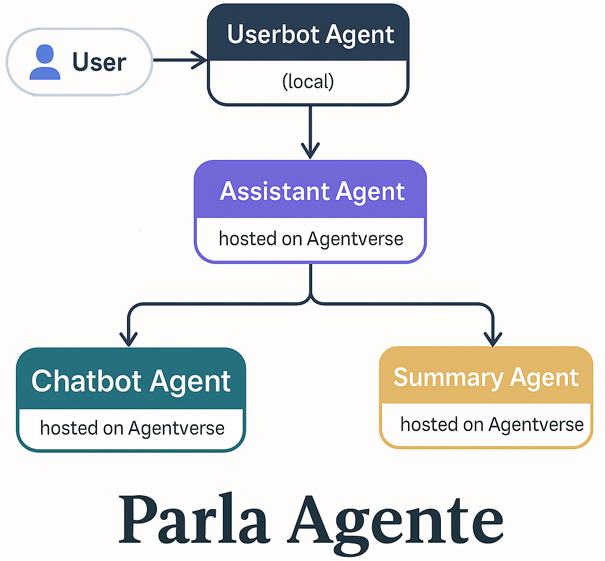

# 🤖 Parla Agente

An AI agent that **chats on your behalf** and then sends you a short summary of the conversation. Parla Agente is a **multi-agent system** designed to simulate natural conversations and deliver concise summaries — so you don’t have to reply to every message.

Created for participation in the [Fetch.ai Hackathon](https://devpost.com/software/parla-agente-speaks-for-you-and-does-it-beautifully) 


## 🧠 What the Agent Does



The three core agents — **Assistant Agent**, **Chat Agent**, and **Summary Agent** — are hosted on Agentverse and work together to handle each conversation.

A fourth agent, the **Userbot Agent**, runs locally and acts as a bridge to your Telegram account. It intercepts incoming messages and forwards them to the Assistant Agent. From there, the Assistant dynamically locates suitable Chat and Summary agents to process and summarize the dialogue.

### 1. `Chat Agent`
_(hosted on Agentverse)_
- Communicates in friendly style using **AI**
- Generates natural, human-like replies

### 2. `Summary Agent`
_(hosted on Agentverse)_

- Takes full conversation history and returns a **brief, friendly summary**
- Uses **AI** to identify the real meaning behind casual chats

### 3. `Assistant Agent`
_(hosted on Agentverse)_

- Coordinates the conversation
- Sends your message to the Chat Agent
- Collects replies and sends full history to Summary Agent when the dialogue ends
- Supports dynamic agent **search and discovery feature** on Agentverse.ai

### 4. `Userbot Agent`
_(hosted on Agentverse, need connect to Mailbox)_

- Connects to your Telegram account
- Forwards messages to Assistant Agent
- Receives and sends replies back via Telegram

## 🔗 Live Agents on Agentverse

You can inspect the main agents running on [Agentverse.ai](https://agentverse.ai):

- 🤖 Assistant Agent: [View agent](https://agentverse.ai/agents/details/agent1qw4gysgas39julunm3ejjles9lrfsqumjqqrs20yfh35lv6z3664yuk0u9u)
- 💬 Chat Agent: [View agent](https://agentverse.ai/agents/details/agent1qttk8danzs0tuyj6drs332fxsk05z9acycakhrgyqxyxn0ky50yugvwcn6u)
- 🧠 Summary Agent: [View agent](https://agentverse.ai/agents/details/agent1qvl93v59uh72cu3fc637h4rdnlgcmjkg3f0xccusykk8y6pdh7x86ttzln8)

> Agents are live and discover each other dynamically using `find_agent()`. You can test this flow by launching the `Userbot Agent` locally.

## 📲 Telegram Integration

Chat with friends and family **without missing a beat**:
- Parla Agente chats **on your behalf**
- Leaves a good impression, respects your time
- Avoids awkward “why aren’t you online?” moments

How it works:
- The `Userbot Agent` connects to your Telegram account using **Telethon**
- Incoming messages are automatically forwarded to the `Assistant Agent`
- The `Chat Agent` responds in your tone
- Replies are sent back via Telegram, just like you wrote them

## 📝 Get a Quick Summary

Want to know what your agent discussed without reading the whole chat?

-   Just type `/summary` in your **Saved Messages** on Telegram.
-   The Userbot Agent will trigger the **Summary Agent**.
-   You’ll get a **short summary** of the conversation in your **Saved Messages** — private and convenient.

This helps you stay in the loop without opening every chat. ✨

## 🔍 Agent Discovery

Instead of hardcoding agent addresses, **Parla Agente** uses a custom `find_agent()` function to find agents dynamically.

It queries [Agentverse.ai](https://agentverse.ai/) for agents with specific tags like: `["innovationlab"]`

That means:

✔️ You don’t need to maintain static addresses  
✔️ Parla Agente can connect to other participants' public agents  
✔️ It’s easier to scale and add new agents in the future


## 💡Example

User sends:
> "Hey! How’s your work? Did you see the news today? Let's catch up soon."

AI replies (via Chat Agent), maintains friendly tone and keeps conversation going.  
When the chat ends, Summary Agent returns:
> "**Summary:** Talked about work, the news, and planned to catch up soon. 🎯"


## ⚙️ Tech Stack

- Python v3.13.2, pip v25.0.1

- [Fetch.ai uAgents Framework](https://docs.fetch.ai/) v0.21.1

- [Agentverse](https://agentverse.ai/) for agent discovery and hosting

- [Google Gemini API](https://developers.google.com/gemini/docs/getting-started), [Gemini 2.0 Flash](https://www.google.com/search?q=gemini+2.0+flash) (Google's AI model)

-  `.env` for secure API keys, VS Code editor

- Telethon (Telegram API wrapper)


## 🚀 How to Run


### 1. Clone the repo and install dependencies:

```bash
python -m  venv  venv
source venv/bin/activate  # Windows: venv\Scripts\activate
pip install  -r  requirements.txt
```

### 2. Add your .env file (see `.env.example`):

Required variables:
- `ASSISTANT_AGENT_HOSTED_ADDRESS`
- `TG_API_ID` and `TG_API_HASH`

#### ASSISTANT_AGENT_HOSTED_ADDRESS 
Already specified, this is the public address of the Assistant Agent.

#### TG_API_ID and TG_API_HASH

You can get these from [my.telegram.org](https://my.telegram.org).

1. Log in with your Telegram account.
2. Click **API Development Tools**.
3. Fill in the form and click **Create application**.
4. Copy your **App api_id** and **App api_hash**.

[Full instructions](https://core.telegram.org/api/obtaining_api_id).

### 3. Start the agents:

```
python userbot_agent.py
```
When you first launch Telethon, you will be asked to enter your phone number (of the account you want to “manage”) and a confirmation code from SMS or another Telegram client.

If two-factor authentication is enabled, you may also be asked for a password.
After successful login, it will create a session file (eg userbot_session.session in the project root).

📌 Note: When you run `userbot_agent.py` locally, it generates a unique agent address and connects to the public Mailbox.

To allow other agents (like the Assistant) to send messages back, you **must register your agent** in the mailbox network:

1. Launch `userbot_agent.py` using the command above.
2. Look for the printed link in the terminal, like:

   https://agentverse.ai/inspect/?uri=http..&address=agent1...

3. Open the link in a browser and click **Connect**.


## 💬 Use Case

Your friend messages you.
Parla Agente chats with them in your tone.
You get a short summary like:
_"She wants to call you this evening."_
No stress. No overload. You stay connected ✨


## 📈 Project Status

✅ Chat Agent (Gemini)

✅ Summary Agent (Gemini)

✅ Assistant coordination logic

✅ Multi-turn conversation flow

✅ Auto-summary after dialogue

✅ Connect to other agents on Agentverse

✅ Telegram integration

## 🛠️ Troubleshooting

If you don't receive messages back:
- Make sure your Userbot Agent is connected to the Mailbox.
- Confirm your Telegram account is properly logged in (check session file).
- Check your `.env` file for correct API keys.

## 📜 License

This project is licensed under the [MIT License](LICENSE).